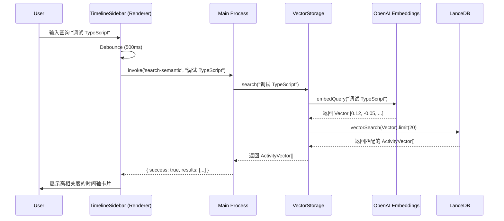

# Timeline AI Search Implementation

## 1. 概述 (Overview)

Timeline 界面的 AI 搜索功能（"AI Search"）仅通过语义理解来检索用户的活动记录。与传统的关键词匹配不同，它使用向量嵌入（Vector Embeddings）技术，使用户能够使用自然语言查询（例如 "我上周在做什么开发"）来查找相关的活动。

目前，核心实现基于 **Electron IPC** 通信、**OpenAI Embeddings** 和 **LanceDB** 向量数据库。

> **注意**: 代码库中存在一个 `SmartSearchService` (`smart-search.service.ts`)，其中包含更复杂的“聚类”和“视频生成”逻辑，但目前在 Timeline 界面中主要使用的仅是基础的语义搜索 (`search-semantic`)。

## 2. 主要组件 (Components)

### 2.1 Frontend (UI)
- **File**: `src/components/Timeline/TimelineSidebar.tsx`
- **Role**:
    - 提供搜索模式切换（Keyword vs AI Search）。
    - 监听用户输入并进行防抖处理 (500ms)。
    - 通过 IPC `search-semantic` 发送查询请求。
    - 接收并展示 `SemanticResult` 列表。

### 2.2 IPC Layer (Main Process)
- **File**: `electron/main.ts`
- **Role**:
    - 注册 `search-semantic` handler。
    - 代理请求到 `VectorStorage`。
    - 负责错误处理和结果封装。

### 2.3 Vector Storage (Data Layer)
- **File**: `electron/storage/vector-storage.ts`
- **Role**:
    - 单例模式，管理 LanceDB 连接。
    - 配置 OpenAI Embeddings（支持 API Key/Base URL 热重载）。
    - 维护 `activity_context` 和 `observation_context` 向量表。
    - 执行向量相似度搜索。

## 3. 核心流程 (Core Flow)

## 4. 关键算法 (Key Algorithms)

### 4.1 语义索引 (Indexing)
当生成新的 Timeilne Card（活动卡片）或 Observation（观察记录）时：
1.  **文本构建**: 将 `title` 和 `summary` 拼接 (`${card.title}: ${card.summary}`).
2.  **嵌入生成**: 调用 OpenAI Compatible API (`text-embedding-3-small` 或其他配置模型) 生成向量。
3.  **存储**: 保存到 LanceDB 的 `activity_context` 表中。

### 4.2 语义搜索 (Search)
1.  **查询嵌入**: 将用户查询转换为向量。
2.  **相似度计算**: LanceDB 计算查询向量与存储向量的距离（通常是余弦相似度或 L2 距离）。
3.  **Top-K 截断**: 默认返回相似度最高的前 20 条记录。
4.  **多表查询**: `VectorStorage` 会同时并行查询 `activity_context` (活动) 和 `observation_context` (原始观察)，并合并结果（目前代码中是简单的 push 合并，未做重排序）。

## 5. 配置与降级
- **LLM 配置**: 系统会自动从全局配置 (`LLMGlobalConfig`) 中读取 `EMBEDDING` 角色配置，如果未找到则回退到 `OpenAI` 提供商，最后尝试寻找任何兼容 OpenAI 的提供商。
- **降级处理**: 如果没有 API Key 或网络错误，搜索将返回空数组，并记录错误原因 (Auth failed 等)。
