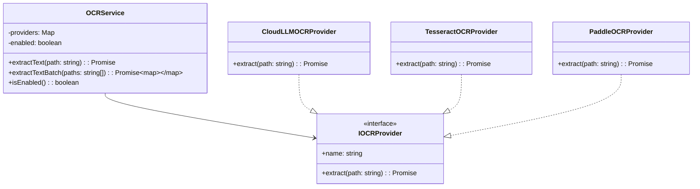
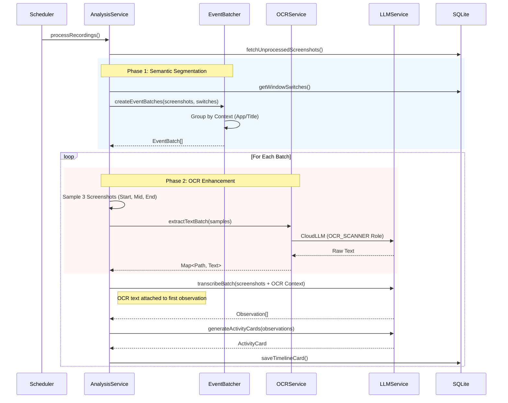

# Enhance Timeline Insights: Architecture Design

## 1. Principles & Goals

The primary goal of this architectural change is to shift **ShuTong's** timeline analysis from a naive time-based approach (every 5 minutes) to a **semantic, event-driven approach**. This ensures that activity cards align with actual user tasks rather than arbitrary time windows.

### Key Principles
1.  **Semantic Segmentation**: A "batch" of activity should strictly correspond to a single logical context (e.g., "Coding in VS Code" vs "Reading Docs in Chrome").
2.  **Context Awareness**: The system must understand *where* the user is (App, Project, File).
3.  **Deep Visual Understanding**: Visual analysis (Vision LLM) is enhanced with textual data (OCR) to bridge the gap between "seeing" a screen and "reading" its content.
4.  **Graceful Degradation**: If advanced features (OCR, Window Events) fail, the system falls back to safe defaults without crashing.
5.  **Intent-Centric Organization**: Users can group diverse activities (coding, researching, writing) into logical **"Topics"** (e.g., "ShuTong Project") for holistic insights.

---

## 2. System Architecture (UML)

### 2.1 Class Diagram: OCR Strategy
The OCR system uses a Strategy Pattern to support multiple backends (Cloud vs Local) while exposing a simple facade to the rest of the application.

### 2.2 Sequence Diagram: Processing Pipeline
This flows shows how a batch of raw screenshots becomes a structured Timeline Card.

---

## 3. Core Modules

### 3.1 Event-Based Batching (`analysis.service.ts`)
Instead of `createScreenshotBatches` (time-based), we now use `createEventBatches`.
- **Input**: Unprocessed screenshots + Window Switch events.
- **Logic**: Iterates through screenshots and checks if the "Context" (App + Window Title parsed by `context-parser.ts`) has changed significantly.
- **Constraints**:
    - **Max Duration**: 15 minutes (hard cap to prevent huge batches).
    - **Gap Tolerance**: 1 minute (small gaps don't break batches).
    - **Context Change**: Switching from VS Code (Project A) to Chrome (StackOverflow) triggers a new batch.

### 3.2 Context Parser (`context-parser.ts`)
A dedicated utility that parses raw window titles into structured data:
- **VS Code**: Extracts `Project Name` and `File Name`.
- **Browser**: Extracts `Domain` and `Page Title`.
- **Comparison**: `isContextChange(A, B)` determines if two contexts are different enough to warrant a split.

### 3.3 OCR Service (`ocr.service.ts`)
- **Sampling**: To save tokens/cost, we don't OCR every frame. We sample 3 frames (Start, Middle, End) per batch.
- **Prompt**: Uses a bilingual (English/Chinese) prompt to extract text, code, and tables.
- **Integration**: Extracted text is prepended to the *first* observation sent to the Summarizer LLM, labeled with `[Image: filename] [OCR Context]`.
- **Safety**: Includes file existence checks, MIME checks, and rate limiting (500ms).

---

## 4. Topic Feature & Schema Updates (New)

To support the "Topic" (Theme/Intent) feature, we need to capture granular context at the data layer.

### 4.1 Concept: "Topic" (主题)
A **Topic** is a user-defined logical grouping of activities. It acts as a "Smart Filter" or "Tag" that aggregates disparate activities into a single view.
- **Example**: "ShuTong Project" Topic includes:
    -   VS Code window with title containing "ShuTong"
    -   Chrome window with domain "github.com" AND title containing "ShuTong"
    -   Word window with title "ShuTong Design"

### 4.2 Database Schema Changes
We extend the SQLite schema to support granular tracking and Topic definitions.

**1. Screenshots Table (`screenshots`)**
We add columns to persist the parsed context *at capture time*. This avoids expensive regex parsing during query time.
-   `project_name` (TEXT): The project name extracted from the window title (e.g., "ShuTong").
-   `domain` (TEXT): The domain name extracted from browser titles (e.g., "github.com").

**2. Topics Table (`topics`)**
-   `id` (INTEGER PRIMARY KEY)
-   `name` (TEXT): Display name (e.g., "ShuTong Project")
-   `color` (TEXT): UI color code
-   `created_at` (DATETIME)

**3. Topic Rules Table (`topic_rules`)**
-   `id` (INTEGER PRIMARY KEY)
-   `topic_id` (INTEGER FK)
-   `field` (TEXT): 'app_bundle_id', 'window_title', 'project_name', 'domain'
-   `operator` (TEXT): 'equals', 'contains', 'starts_with'
-   `value` (TEXT): The matching value

### 4.3 Data Flow Update
1.  **Capture**: `capture.service.ts` calls `context-parser.ts` -> extracts `project` & `domain` -> saves to `screenshots` DB.
2.  **Analysis**: Batching logic can now group by `project_name` for tighter cohesion.
3.  **Visualization**: The Timeline UI can query: `SELECT * FROM screenshots WHERE project_name = 'ShuTong'` to generate a Topic-specific timeline.

---

## 5. Highlights & Improvements

### Highlights
1.  **Hybrid Analysis**: Combines computer vision (Screenshot -> Vision LLM) with textual extraction (OCR -> Text). This allows the AI to "read" error messages or code snippets that might be blurry in a resized image.
2.  **Robust Fallbacks**:
    - If Window Events are missing, falls back to time-based batching.
    - If OCR fails (API down), proceeds with just visual analysis.
3.  **Dynamic Configuration**: OCR can be toggled on/off at runtime without restarting.

### Difficulties
1.  **Context Synchronization**: Mapping screenshots (captured every 2s) to Window Events (captured on change) requires O(N) alignment. We optimized this using an index pointer to avoid O(N^2).
2.  **Token Limits**: OCR text can be huge. We implemented a per-image truncation strategy (800 chars) to preserve context diversity without overflowing the context window.

### Possible Improvements
1.  ~~**Local OCR**: Implement `OnnxRuntime` + `PaddleOCR` in Electron to allow offline OCR and reduce cloud costs.~~ **✅ Implemented** using `@paddlejs-models/ocr` with WebGL acceleration. Includes warmup at startup and circuit breaker fallback.
2.  **Vector Search**: Store OCR text in the Vector Database (OpenMemory) to allow semantic searching of "what was I reading?".
3.  **Topic Coherence**: Allow dynamic batch resizing based on semantic similarity analyzed by the LLM, rather than just hard context switches.
