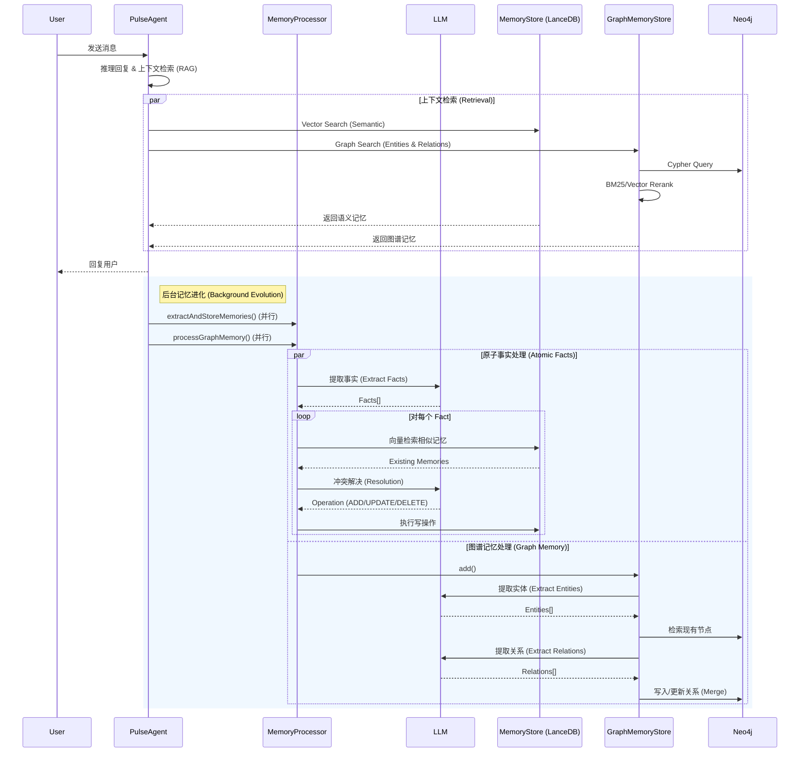

# PulseAgent 记忆系统 V2：架构详解 (BaseStore + Mem0 + Graph)

该文档详细描述了 PulseAgent 记忆系统的最新架构。该系统建立在 **LangGraph BaseStore** 基础设施之上，并集成了 **Mem0 风格** 的智能记忆管理算法以及 **Graph Memory** 图谱记忆能力，旨在创建一个自我修正、持续进化的 Agent 知识库。

## 一、 核心设计理念

PulseAgent 的记忆系统已经从单纯的“日志记录”转变为主动的“知识管理”。

1.  **记忆原子化 (Atomicity)**：将非结构化的用户对话提取为独立的、原子级的事实（Fact）。
2.  **动态冲突解决 (Conflict Resolution)**：通过 LLM 判断新事实与旧记忆的关系，自动执行添加、更新或删除操作，保持知识库的一致性。
3.  **图谱关联 (Graph Association)**：除了向量相似度，通过知识图谱（Entity-Relation）显式捕捉实体间的复杂关系。
4.  **标准化接口 (Standardization)**：底层存储完全兼容 LangGraph `BaseStore` 接口，支持依赖注入和后端热替换。

## 二、 架构分层

### 1. 逻辑层：MemoryProcessor (Mem0 核心)
这是记忆系统的“大脑”，负责执行多维度的处理流程：

*   **维度一：原子事实提取 (Atomic Facts)**
    *   **Extraction**: 调用 LLM 提取关键事实 (例如：`"User likes Python"`)。
    *   **Resolution**: 比较新事实与旧记忆，决定 ADD/UPDATE/DELETE/NONE 操作。

*   **维度二：图谱记忆处理 (Graph Memory)**
    *   **Entity Extraction**: 识别对话中的关键实体。
    *   **Relation Extraction**: 建立实体间的有向关系 (Source -> Relation -> Target)。

### 2. 存储层：MemoryStore (基于 BaseStore)
这是记忆系统的“硬盘”，实现了 LangGraph 官方 `BaseStore` 接口。

*   **依赖注入**：在 Agent 图构建时注入。
*   **命名空间**：使用 `[userId, 'memories']` 进行隔离。
*   **向量能力**：利用 LanceDB 的向量搜索能力。

### 3. 图谱层：GraphMemoryStore (New)
这是记忆系统的“关系引擎”，负责处理复杂的实体互联。

*   **存储引擎**: Neo4j (通过 `neo4j-driver`)。
*   **功能**: 提取 Entity-Relationship 三元组，支持多跳查询。
*   **优化**: 与 `MemoryStore` 共享 Embeddings 实例，且支持 BM25 重排序优化检索结果。

## 三、 完整处理流程

当 PulseAgent 收到用户消息或完成思考后的后台处理流程，包含了**原子事实处理**与**图谱记忆处理**并行进行的机制：



详细步骤：

1.  **触发 (Trigger)**：
    `PulseAgent` 将对话消息放入处理队列，触发后台 Promise。

2.  **并行处理 (Parallel Processing)**：
    系统并行启动“原子事实”链路和“图谱”链路。

3.  **提取与决策 (Extract & Decide)**：
    *   **Atomic**: `MemoryProcessor` 提取事实，并对每个事实进行“检索-决策-执行”的闭环。
    *   **Graph**: `GraphMemoryStore` 提取实体与关系，并在 Neo4j 中执行 Merge 操作，确保图谱的连通性。

4.  **执行 (Execute)**：
    *   **LanceDB**: 写入扁平的语义/情景记忆。
    *   **Neo4j**: 更新节点与边，构建知识网络。

## 四、 架构优势对比

| 特性 | V1 (Legacy) | V2 (BaseStore + Mem0) | V2.1 (Graph Enhanced) |
| :--- | :--- | :--- | :--- |
| **记忆粒度** | 整段对话摘要 | 原子事实 (Fact) | 实体与关系 (Entity-Relation) |
| **关联性** | 弱（仅靠语义相似） | 中（靠向量聚类） | 强（显式图连接） |
| **更新机制** | Only Append | CRUD (动态冲突解决) | Graph Merge (图谱融合) |
| **底层实现** | 硬编码 LanceDB | 标准 BaseStore | LanceDB + Neo4j |
| **推理能力** | 简单问答 | 上下文增强 | 多跳推理 (Multi-hop Reasoning) |

## 五、 数据结构 (TypeScript)

```typescript
// --- 原子事实 (Atomic) ---
interface Fact {
    content: string;
    category: string;
    confidence: number;
}

// 存储项 (LanceDB)
interface MemoryItem {
    id: string;
    content: string;
    type: "semantic" | "episodic" | "procedural";
    metadata: {
        created_at: number;
        user_id: string;
    }
}

// --- 图谱记忆 (Graph) ---
interface GraphEntity {
    name: string;
    type: string;
    description: string;
}

interface GraphRelation {
    source: string;
    relationship: string; // e.g., "LIKES", "WORKED_ON"
    destination: string;
}

interface GraphStoreConfig {
    enabled: boolean;
    url?: string;
    username?: string;
    password?: string;
}
```

## 六、 未来规划

1.  **来源溯源 (Source Context)**：在元数据中记录记忆来源的具体消息 ID，便于调试和溯源。
2.  **图谱可视化 (Graph Visualization)**：为用户提供知识图谱的可视化界面，方便查看 Agent 的知识结构。
3.  **高级图推理 (Advanced Reasoning)**：利用图算法（如 PageRank, Community Detection）发现潜在的用户兴趣社群或隐性关联。
