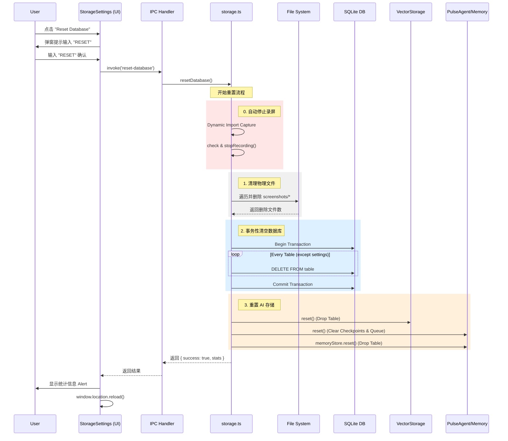

# 数据库重置 (Reset Database) 设计文档

## 1. 功能概述 (Overview)

"Reset Database" 功能旨在允许用户将应用恢复到干净的初始状态，清除所有累积的用户数据，同时保留关键的应用程序配置。这在调试、清理磁盘空间或用户希望重新开始记录时非常有用。

### 核心能力
*   **清除所有业务数据**: 包括时间轴 (Timeline)、截图 (Screenshots)、AI 对话历史 (Pulse Chat)、AI 长期记忆 (Memories) 和向量检索数据 (Vector Context)。
*   **保留用户设置**: 特意保留 `settings` 表，确保用户的偏好设置（如存储路径、模型配置、保留期限）不会丢失。
*   **安全防护**:
    *   **双重确认**: 必须输入 "RESET" 关键字才能执行，防止误操作。
    *   **事务保护**: 数据库操作具有原子性，防止出现部分删除的数据不一致状态。
*   **用户反馈**: 提供详细的删除统计（文件数、表数）并自动刷新 UI。

## 2. 架构设计 (Architecture)

该功能采用 **协调者模式 (Orchestrator Pattern)**，由主进程中的 `storage.ts` 作为中心协调者，负责调度各个独立存储模块的重置操作。

### 模块交互
1.  **Renderer (Frontend)**: `StorageSettings.tsx` 负责 UI 交互、确认逻辑和 IPC 调用。
2.  **Main (Backend)**: `storage.ts` 接收 IPC 请求，并按顺序执行清理任务。
3.  **Sub-systems**:
    *   **File System**: 负责物理删除截图文件。
    *   **SQLite**: 负责清空关系型数据表。
    *   **VectorStorage**: 负责重置 LanceDB 中的活动上下文。
    *   **MemoryStore**: 负责重置 LanceDB 中的长期记忆。
    *   **PulseAgent**: 负责重置运行时状态和对话检查点。

## 3. 实现流程 (Implementation Flow)



## 4. 关键实现细节 (Key Implementation Details)

### 4.1 事务安全性 (Transactional Safety)
为了保证 SQLite 数据的完整性，所有表的 `DELETE` 操作都被包裹在一个事务中：
```typescript
const clearTablesTransaction = db.transaction(() => {
    for (const table of tablesToClear) {
        db.exec(`DELETE FROM ${table}`);
        stats.tablesCleared++;
    }
});
clearTablesTransaction();
```
如果任何一个表的删除失败，整个操作将回滚，避免数据库处于损坏状态。

### 4.2 并发竞争处理 (Race Condition Handling)
在重置过程中，如果后台 AI Agent 正在运行（例如正在提取记忆），可能会将"幽灵数据"写入刚清空的数据库。
**解决方案**: 在 `PulseAgent.reset()` 中强制清空内存中的任务队列：
```typescript
public reset(): void {
    this.checkpointer.reset();
    this.memoryExtractionQueue = []; // 关键：防止重置后写入残留数据
}
```

### 4.3 录屏状态管理 (Recording State Management)
为了防止文件锁冲突和数据不一致，重置前会自动检测并停止录屏：
```typescript
const { getIsRecording, stopRecording } = await import('./features/capture');
if (getIsRecording()) {
    stopRecording();
}
```
使用 **Dynamic Import** 避免了 `storage` 和 `capture` 模块之间的循环依赖。

### 4.4 存储重置策略 (Storage Reset Strategy)
对于 **LanceDB** (用于 Vector 和 Memory)，采用了 **Drop Table** 策略而不是 Delete All：
1.  检测表是否存在。
2.  如果存在，直接 `dropTable()`。
3.  将内部表引用置为 `null`。
4.  当下次有数据写入时（`add` 或 `put`），系统会自动检测表不存在并重新创建 Schema。
这种方式比逐条删除更高效且更彻底。

### 4.4 统计与反馈 (Statistics & Feedback)
后端会收集执行指标（`filesDeleted`, `tablesCleared`）并返回给前端。前端不仅显示成功消息，还会展示具体的清理数量，增强用户的掌控感。

### 4.5 退出保护 (Quit Protection)
为了防止用户在重置过程中意外退出应用（导致数据库损坏），实现了全局退出拦截：
1.  **State Lock**: `storage.ts` 维护 `isResetting` 状态锁。
2.  **Tray Guard**: `tray.ts` 在点击 "Quit" 时检查锁，如果锁定则弹窗拦截。
3.  **Global Guard**: `main.ts` 监听 `before-quit` 事件，作为最后一道防线拦截所有退出尝试（如 Cmd+Q）。

## 5. 涉及文件 (Files Involved)

*   **Logic**: `electron/storage.ts` (主入口)
*   **Vector**: `electron/storage/vector-storage.ts`
*   **Memory**: `electron/features/pulse/agent/memory-store.ts`
*   **Agent**: `electron/features/pulse/agent/pulse-agent.ts`
*   **UI**: `src/components/Settings/StorageSettings.tsx`
*   **Contract**: `shared/ipc-contract.ts`
