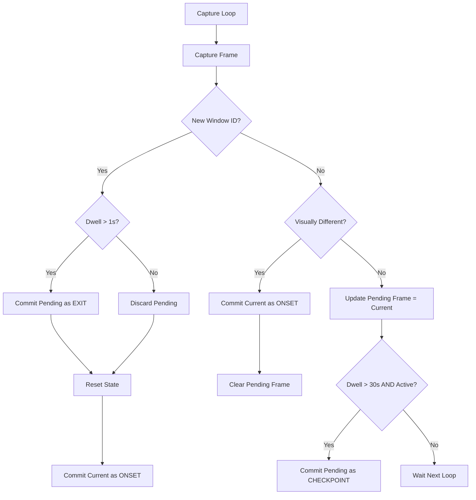

# OpenSpec Change Proposal: Smart OCR Keyframe Strategy (Buffer-Commit Protocol)

## 1. Summary
This proposal introduces a "Buffer-Commit" mechanism for screen capture and OCR analysis. The goal is to maximize the information density of captured frames while minimizing redundant OCR costs. It shifts the paradigm from "Capture on Change" to "Capture on Significance" (Onset, Dwell-Input, and Exit).

## 2. Problem Statement
Current implementation (`capture.service.ts` + `frame-dedup.ts`) uses a simple "deduplication" logic: if a frame is similar to the last saved frame, it is discarded. 

**Deficiencies:**
1.  **Loss of Final State**: When a user spends time on a window (e.g., writing an email) and then switches away, the *last* frame (containing the full email) is often discarded because it is "similar" to the frame captured 10 seconds ago. This "Exit Frame" is often the most valuable one.
2.  **Redundant OCR**: OCR might be triggered on the first frame of a window (Onset), which might be still loading or empty, wasting tokens.
3.  **Missing "Work in Progress"**: Long dwelling with active input (typing/scrolling) is not effectively captured as a strong signal for re-analysis.

## 3. Proposed Solution: Buffer-Commit Protocol

We introduce a stateful `CaptureSession` that maintains a `pendingBuffer` (the latest "similar" frame seen) and commits it to disk/OCR only when specific semantic triggers occur.

### 3.1 Core Concepts

*   **Onset Keyframe**: The first frame when a visual change is detected (Screen Refresh / Navigation).
*   **Pending Frame**: A frame that is visually similar to the last saved frame but is *newer*. It is held in memory buffer.
*   **Exit Keyframe**: The `pendingFrame` committed when the user switches the active window. This captures the "final state" of the previous context.
*   **Checkpoint Keyframe**: A `pendingFrame` forced to commit because the user has been dwelling and interacting (input) for a long time (e.g., > 30s).

### 3.2 Logic Flow (Implemented)

### 3.3 Refined Rules (Addressing Edge Cases)

1.  **Minimum Dwell Time (Anti-Flicker)**:
    *   **Problem**: Rapid Alt-Tab switching creates noise.
    *   **Rule**: An "Exit Keyframe" is only saved if the user dwelled on that window for at least `minDwellTime` (e.g., 1000ms). Otherwise, the `pendingFrame` is discarded.

2.  **Input Activity Integration**:
    *   **Problem**: "Similar" frames might be just a user staring at the screen vs. user typing a novel.
    *   **Rule**: `Checkpoint Keyframe` requires positive input signals (keyboard/mouse clicks) within the dwell window. (Leveraging `capture-guard`'s idle detection).

3.  **Resource Management**:
    *   **Rule**: `pendingBuffer` must be strictly managed to prevent memory leaks. It should be a single reference replaced on every loop.

## 4. Technical Implementation Changes

### 4.1 `electron/features/capture/frame-dedup.ts`
*   Modify `isFrameSimilar` to return more than a boolean. It should perhaps return a diff score and allow managing the "reference grid" explicitly.

### 4.2 `electron/features/capture/capture.service.ts`
*   Refactor the main capture loop to implement the State Machine.
*   Introduce `CaptureSession` class to hold:
    *   `lastWindowId`: number
    *   `lastSavedBuffer`: Buffer
    *   `pendingBuffer`: Buffer
    *   `windowEnterTime`: number
    *   `lastInputTime`: number

### 4.3 `electron/features/timeline/ocr.service.ts`
*   No major changes, but `OCRService` calls will now be triggered by these specific events (Onset, Exit, Checkpoint).

## 5. Verification Plan
*   **Unit Test**: Mock `desktopCapturer` and `activeWindow`. Simulate a sequence of frames (A -> A' -> A'' -> B) and verify that A (Onset) and A'' (Exit) are saved, while A' is skipped.
*   **Manual Test**: Open Notepad, type "Hello", wait 5s, type "World", switch window. Verify the captured timeline shows the final "Hello World" state.

## 6. Implementation Status

| Feature | Status | Notes |
|---------|--------|-------|
| Onset Keyframe | ✅ Implemented | First frame of new window or visual change |
| Pending Frame Buffer | ✅ Implemented | Similar frames buffered in memory |
| Exit Keyframe | ✅ Implemented | Saved when window switches, if dwell > 1s |
| Minimum Dwell Time | ✅ Implemented | 1000ms threshold, prevents Alt-Tab noise |
| Checkpoint Keyframe | ✅ Implemented | Every 30s if user is active (not idle) |
| Trigger Type in captureType | ✅ Implemented | `screen:onset`, `window:exit`, etc. |

**Unit Tests**: 6 tests covering Onset, Buffer, Exit, and Checkpoint scenarios in `tests/unit/capture-keyframe.test.ts`.
