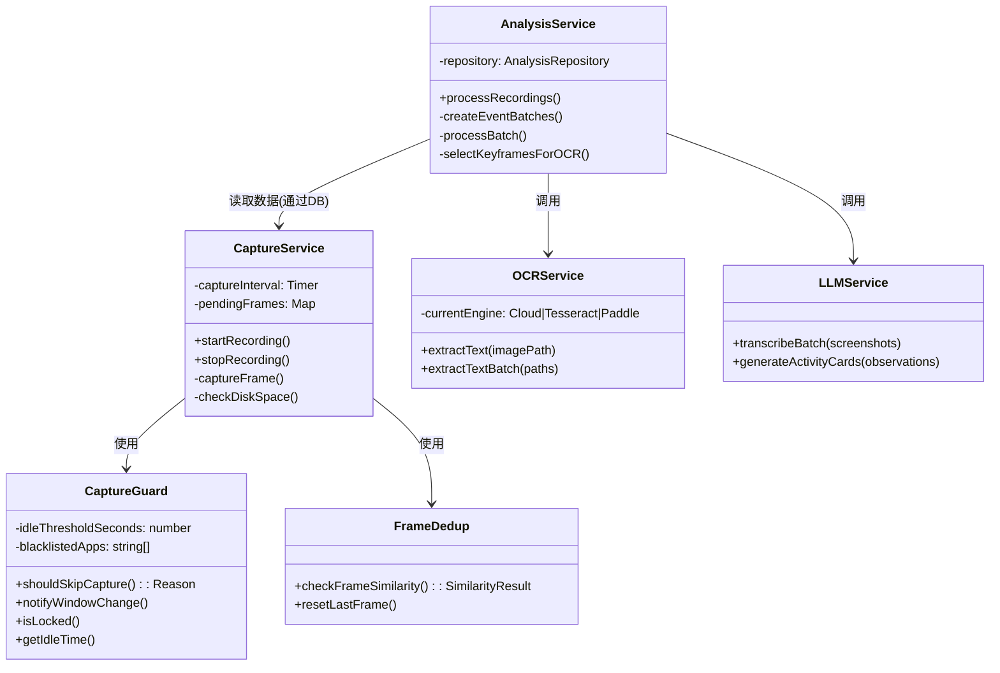
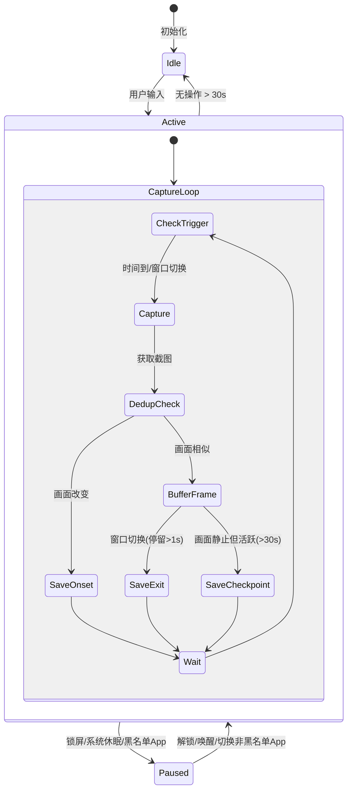
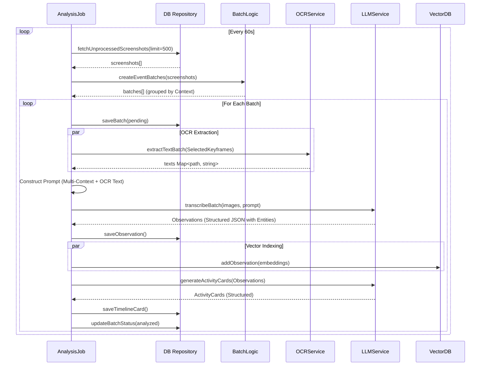

# Timeline 功能实现详情

## 1. 概述

Timeline 是 ShuTong 的核心功能之一，旨在通过智能截屏、OCR 文本提取和多模态 AI 分析，自动生成用户电脑活动的时间轴记录。该系统能够将用户的碎片化操作转化为结构化的活动卡片（Activity Card），方便用户回顾、检索和洞察。

## 2. 系统架构

Timeline 的实现采用模块化设计，主要包含以下几个核心服务：

*   **Capture Service (采集服务)**: 负责底层的屏幕截图、窗口状态监控和初步的数据清洗（去重、隐私过滤）。
*   **Analysis Service (分析服务)**: 异步处理服务，负责将原始截图转化为结构化数据。它协调 OCR 和 Vision LLM。
*   **OCR Service (文字提取服务)**: 提供图片的文字提取能力，支持本地（Paddle/Tesseract）和云端（LLM）多种引擎。
*   **Timeline Repository (存储层)**: 基于 SQLite 的数据持久化层，存储截图元数据和生成的卡片。

### 2.1 类图 (Class Diagram)



## 3. 核心算法与流程

Timeline 的数据处理主要分为两个阶段：**同步采集阶段** 和 **异步分析阶段**。

### 3.1 截图采集 (Check & Capture)

采集服务在一个动态频率的循环中运行，核心逻辑包括智能去重、关键帧判定和隐私保护。

**核心逻辑：**

1.  **触发时机**：
    *   基础频率：默认 1秒/次。
    *   **电池优化**：通过 `powerMonitor` 检测电源状态。如果使用电池，采集间隔会自动延长（默认 x2）。
    *   **窗口切换**：监听窗口焦点变化，进行防抖（Debounce）处理后立即触发一次检查。

2.  **智能守卫 (Capture Guard)**：
    *   **Idle 检测**：调用 `powerMonitor.getSystemIdleTime()`。如果用户空闲时间超过阈值（默认 30秒），暂停采集。
    *   **锁屏/睡眠**：监听系统锁屏 (`lock-screen`) 和挂起 (`suspend`) 事件，状态下直接停止采集。
    *   **隐私黑名单**：检查当前活跃窗口的 App 名称（如 1Password）或 窗口标题（如 "Private"），匹配黑名单则跳过。
    *   **白名单模式**：如果开启白名单模式，仅采集指定 App。

3.  **去重与关键帧 (Smart Keyframe Strategy)**：
    *   **相似度检测**：将当前帧缩放并计算像素差异。如果与上一帧（上一张已入库的，而不是上一张瞬间的缓存帧）相似度高（差异 < 5%），则视为重复。
    *   **关键帧类型**：
        *   **Onset (起始帧)**：当画面发生显著变化时，立即保存。
        *   **Exit (结束帧)**：当通过 `ActiveWindow` 检测到 App 切换时，如果用户在上一界面停留超过 1秒，会将上一界面的缓存帧保存为 Exit 帧。这确保了用户视线离开前的最终状态被记录。
        *   **Checkpoint (检查点)**：如果用户持续活跃（鼠标/键盘移动）但画面保持静止（例如阅读长文），每 30秒 强制保存一帧。

**状态图 (Capture Lifecycle)**



### 3.2 异步分析 (Analysis Pipeline)

分析服务作为一个后台作业 (`cron job`)，每 60秒 运行一次，处理未分析的截图。

1.  **批次聚合 (Event-based Batching)**：
    *   系统不再简单按时间切分，而是基于 **窗口切换事件 (Window Switch Event)** 进行语义分段。
    *   **Context**：每个截图都会关联当前的 Activity Context（App名称, 窗口标题）。
    *   **切分规则**：
        *   上下文改变（用户从 VS Code 切换到了 Chrome）。
        *   时间间隔过大（用户离开了一段时间）。
        *   最大时长限制（单个批次不超过 15分钟）。
    *   **回退机制**：如果事件数据缺失，回退到基于时间的切分（1分钟/批）。

2.  **OCR 增强 (Smart Sampling)**：
    OCR 并不只会 对关键帧（Keyframe）进行解析，但它确实采用了**智能采样策略** 来平衡性能和信息提取的完整性。
    *   **采样策略**：为了节省资源，不会对每一帧都做 OCR。
        *   **优先最后帧**：每个批次的最后一帧通常代表了用户操作的最终结果或意图。
        *   **过滤桌面**：跳过 "Program Manager" 等无效桌面截图。
        *   **中间采样**：如果一个活动持续时间较长（超过 60 秒）或图片较多（超过 10 张），系统会额外挑选：
            - 第一帧 ：捕捉活动的起始上下文。
            - 中间帧 ：捕捉活动过程中的状态变化。
    *   **引擎选择**：默认为 Cloud LLM (Vision)，如果配置了本地环境，可降级使用 Tesseract 或 PaddleOCR。
    *   **结果注入**：提取的文本会被截断并注入到后续的 Vision LLM Prompt 中，作为 `[OCR Context]`。
    *   **注意**：由于抓屏已经过了“去重”处理，剩下的图片在视觉上已经具有代表性。通过“首、中、尾”的采样，已经足以提取出该活动的大部分文本关键信息（如正在编辑的文件名、网页标题、关键代码片段等）。

3.  **多层级视觉分析 (Multi-Context Vision Analysis)**：
    *   **通用 Prompt**：不再使用硬编码的场景模板，而是采用统一的、能力更强的系统提示词 (`screenshot_analyze`)。
    *   **多维度提取**：该 Prompt 指导 LLM 同时识别和提取多种类型的上下文信息：
        *   **Activity Context (活动)**：用户正在做什么（代码编写、文章阅读）。
        *   **Semantic Context (语义)**：知识性内容（如文档中的架构原理、代码中的算法逻辑）。
        *   **State Context (状态)**：系统或项目状态（进度条、看板状态）。
        *   **Procedural Context (流程)**：可复用的操作步骤。
    *   **结构化输出**：LLM 直接返回 JSON 格式，包含 Context Type、摘要、关键词以及**结构化实体 (Entities)**（如项目名、人员、工具）。

**时序图 (Processing Flow)**



## 4. 关键算法细节

### 4.1 窗口切换防抖 (Window Switch Debounce)
为了避免用户快速 `Alt+Tab` 造成的无意义截图，Capture Guard 使用了防抖机制：
*   当检测到窗口句柄变化时，记录 `WindowSwitchEvent`。
*   启动一个延迟定时器（默认 2000ms）。
*   如果在延迟期间窗口又发生了变化，重置定时器。
*   只有当窗口焦点稳定后，才触发截图和 Context 更新。

### 4.2 像素级去重 (Frame Deduplication)
为了节省存储空间，系统计算每一帧的"信息量"：
*   **缩放**：将截图缩放至低分辨率或根据比例缩小。
*   **差异哈希**：对比当前缓冲区与上一帧的像素差异。
*   **判断**：如果差异像素比例小于阈值（0.05），视为 `SIMILAR`。`SIMILAR` 的帧不会立即丢弃，而是缓存在内存中 (`pendingFrames`)，用于可能的 Exit 帧回溯；只有当下一帧真正变化时，旧的相似帧才会被释放。

### 4.3 多模态上下文感知 (Multi-Modal Context Awareness)
新的提示词系统（Prompts V2）不再依赖预定义的场景分类，而是利用 Vision LLM 的推理能力主动发现截图中的多层含义：
*   **混合类型识别**：一张截图可能同时包含 "正在写代码" (Activity) 和 "React Hook 规范" (Semantic)。
*   **实体链接**：强制提取截图中的关键实体（如 `Project: ShuTong`, `Tool: VS Code`），为后续构建**图谱记忆 (Graph Memory)** 提供数据基础。
*   **风格自适应**：依据识别出的 Context Type，自动调整摘要的语言风格（如 Procedural Context 使用步骤式描述）。

## 5. 智能会话合并 (Session Merger)

### 5.1 背景与问题
基于窗口切换的实时分批策略会在用户进行"频繁、短暂的上下文切换"时产生过多碎片化卡片。例如：用户在写代码时短暂切换到 Chrome 查一个文档，又马上切换回 VS Code 继续，这可能产生 3 张 1 分钟的短卡片，而非 1 张 3 分钟的"写代码"卡片。

### 5.2 设计方案：后处理智能合并 (Scheme B)
为了解决碎片化问题，引入了 `SessionMerger` 服务进行后处理合并：

**核心组件：**
*   **`merge.service.ts`**: 包含 `SessionMerger` 类。
*   **`LLMService.mergeCards()`**: 新增 LLM 方法，用于评估一组卡片是否应该合并。

**处理流程：**
1.  **触发**：在 `processRecordings()` (analysis.service.ts) 完成所有批次处理后自动调用。
2.  **候选识别**：`SessionMerger` 获取最近 2 小时内的所有卡片，按时间排序，并识别"候选合并组"。
    *   **合并条件**：相邻卡片之间的时间间隔 < 2 分钟。
3.  **LLM 判断**：将候选组的标题和摘要发送给 LLM，询问："这些活动是否属于同一个连续任务/会话？"。
    *   LLM 返回 `should_merge: true/false` 及合并后的新标题、摘要。
4.  **执行合并**：
    *   如果 LLM 确认合并，创建一个新的"合并卡片" (`is_merged = 1`)，其时间范围覆盖原有所有卡片。
    *   删除原有碎片卡片。

**数据库变更：**
*   `timeline_cards` 表新增 `is_merged INTEGER DEFAULT 0` 列。
*   `getCardDetails` 查询对 `is_merged = 1` 的卡片使用纯时间范围查询 Observations，不受 `batch_id` 限制。

```mermaid
flowchart LR
    A[Analysis Job] --> B{processBatch()}
    B --> C[Save Observations]
    C --> D[Generate Cards]
    D --> E{Session Merger}
    E --> F[Identify Merge Groups]
    F --> G{LLM mergeCards()}
    G -- should_merge: true --> H[Save Merged Card]
    H --> I[Delete Old Cards]
    G -- should_merge: false --> J[Keep Cards As-Is]
```

