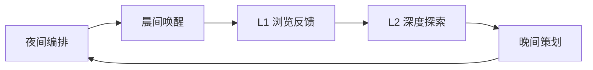
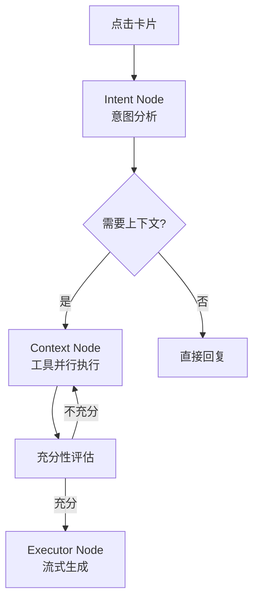

# **产品需求文档 (PRD) - Project Insight (Pulse)**

**版本:** 0.2.0
**状态:** 集成 OpenContext 增强版
**日期:** 2025-12-23

**目标受众:** AI 辅助开发工具 (Google Antigravity), 全栈开发团队, 产品团队

---

## **1. 产品概述 (Executive Summary)**

### **1.1 核心愿景：从"被动工具"到"主动伙伴"**

当前 AI 产品的核心痛点在于"能力强但用户不会用"以及用户的"定势效应（Einstellung Effect）"——用户往往满足于浅层答案而停止探索。

Project Insight (Pulse) 旨在通过主动服务打破这一僵局。它不仅仅是一个聊天机器人，而是一个 **"错时异步的主动式情报与行动助理"**。

利用用户休息时间，AI 在后台基于 **多维上下文数据**（屏幕活动、文档、待办、日报）进行深度研究与行为规划，在清晨以结构化信息流 (Feed) 的形式，主动呈上一份高度个性化的"今日情报"。

### **1.2 核心价值主张**

1. **对抗认知偏见:** 通过主动推送意外发现（Serendipity），引导用户发现那些"不知道自己不知道"的盲区。
2. **降低交互门槛:** 将高成本的"Prompt 构思"转化为低成本的"点击/反馈"操作。
3. **结构化与时效性:** L1（卡片）负责广度，L2（对话）负责深度；"阅后即焚"机制制造仪式感。
4. **数据飞轮:** 通过显式反馈（赞/踩/策划）不断微调 Agent 的关注模型，越用越懂用户。

### **1.3 与 ShuTong 现有功能的整合** [NEW]

> [!IMPORTANT]
> 集成 OpenContext 后，Pulse 将获得更丰富的数据源和智能能力。

| 现有功能 | Pulse 整合方式 |
|---------|---------------|
| **屏幕录制 (capture.ts)** | 作为活动上下文的核心数据源 |
| **Timeline Cards** | 复用作为 Sprouting 卡片的素材 |
| **Journal 日记** | 作为意图/反思上下文输入 |
| **LLM 分析管道** | 扩展为 LangGraph Agent 工作流 |

#### OpenContext 带来的新能力

| 能力 | 说明 | Pulse 应用场景 |
|-----|------|---------------|
| **向量语义搜索** | 基于 LanceDB 的相似度检索 | 发芽卡的"旧笔记关联" |
| **智能提醒生成** | SmartTipGenerator | 直接转化为 Challenge 卡片 |
| **待办识别** | SmartTodoManager | 生成 Action 卡片 |
| **实体归一化** | ProfileEntityTool | 跨卡片实体关联 |
| **活动摘要** | RealtimeActivityMonitor | Briefing 卡片素材 |
| **日报生成** | ReportGenerator | 长期记忆的结构化输入 |

---

## **2. 战略目标 (OKRs)**

### **2.1 目标 1: 提升交互深度**

* **KR1:** 将用户交互模式从单次问答转变为多轮探索，单次卡片触发的平均对话轮次 > 5。
* **KR2:** L1 到 L2 的转化率（卡片展开/追问率）> 30%。

### **2.2 目标 2: 建立用户习惯**

* **KR1:** 60% 的 DAU 在配置的晨间时间前完成"今日 Pulse"的查阅。
* **KR2:** 建立"反馈循环"，每日活跃用户的主动反馈率（赞/踩/引导） > 50%。

---

## **3. 用户角色与核心路径**

### **3.1 目标用户画像**

* **早期探索者:** 高频使用 AI，渴望提升效率但受限于 Prompt 技巧。
* **知识工作者:** 需要处理大量碎片化信息，需要 AI 充当"第二大脑"。

### **3.2 核心用户循环 (The Core Loop)**



1. **夜间编排 (The Nightly Workflow):**
   - Collect: 收集向量存储中的活动/意图/实体上下文
   - Process: 去重/时效分析/语义合并
   - Reason: LangGraph Agent 生成洞察
   - Filter: 安全检查

2. **晨间唤醒 (The Morning Brief):**
   用户打开 App，收到个性化问候："早安，基于昨天的活动，为您准备了 5 条洞察。"

3. **L1 浏览与反馈:**
   用户快速扫读卡片。对不感兴趣的点"踩"，对有价值的点"赞"或"保存"。

4. **L2 深度探索:**
   点击卡片进入 Chat 界面，系统自动注入相关上下文，无需 Prompt 即可开始深度对话。

5. **晚间策划:**
   用户可对 Agent 下达指令："明天帮我重点关注项目 X 的进展。"

---

## **4. 功能需求说明 (Functional Requirements)**

### **4.1 首页：Pulse 智能卡片流**

* **有限流:** 每日仅推送 5-10 张高价值卡片，不支持无限下拉。
* **24小时生命周期:** 未保存的卡片在次日更新时自动归档/销毁。
* **状态管理:** 卡片具备 `UNREAD`, `READ`, `SAVED`, `DISMISSED` 状态。

### **4.2 卡片类型矩阵 (Card Typology)** [ENHANCED]

| 卡片类型 | 描述 | 触发源 (OpenContext) | 示例 |
|---------|------|----------------------|------|
| **Briefing (简报卡)** | 活动摘要 + 关键洞察 | `RealtimeActivityMonitor` + 向量搜索 | "昨天您在 VS Code 专注了 4 小时" |
| **Action (行动卡)** | 待办拆解 + 一键执行 | `SmartTodoManager` | "识别到任务：完成项目报告（截止明天）" |
| **Sprouting (发芽卡)** | 基于旧笔记的深度联想 | `SemanticContextTool` + 向量相似度 | "3天前的会议笔记与今天的活动相关" |
| **Challenge (反直觉卡)** | 提醒用户逃避的事项 | `SmartTipGenerator` | "您推迟了 3 次'健身计划'" |
| **Meta (策划卡)** | 反馈与控制入口 | 系统默认 | "对今天的推荐满意吗？" |

### **4.3 L2 沉浸式对话 (Contextual Chat)** [ENHANCED]

基于 OpenContext 的 **Agent 工作流** 增强对话能力：



**可用工具集（LangGraph Agent）：**
- `ActivityContextTool`: 检索活动上下文
- `IntentContextTool`: 检索意图上下文
- `SemanticContextTool`: 语义相似度检索
- `GetDailyReportsTool`: 获取历史日报
- `GetTodosTool`: 获取待办事项
- `ProfileEntityTool`: 实体画像归一化

### **4.4 信任与安全**

* **分层授权:**
  * Level 1: 仅屏幕活动数据
  * Level 2: 文档/笔记访问
  * Level 3: 外部服务集成（未来）
* **可解释性:** 每张卡片需标注来源（例："基于 ActivityContextTool 检索"）。

---

## **5. 技术架构与数据规范**

### **5.1 数据模型 (Schema Definition)** [ENHANCED]

```typescript
// 用户配置与权限
interface UserProfile {
  id: string;
  permissions: {
    activity_access: boolean;      // 屏幕活动
    document_access: boolean;      // 文档/笔记
    external_access: boolean;      // 外部服务（未来）
  };
  preferences: {
    topics: string[];              // 关注主题
    anti_procrastination_mode: boolean;
    morning_brief_time: string;    // 晨间推送时间
  };
}

// 核心 Pulse 卡片对象 - 与 OpenContext ProcessedContext 对齐
interface PulseCard {
  id: string;
  userId: string;
  date: string;                    // YYYY-MM-DD
  type: 'BRIEFING' | 'ACTION' | 'SPROUTING' | 'CHALLENGE' | 'META';
  
  // L1 展示层数据
  display: {
    title: string;
    summary_bullets: string[];
    image_url?: string;
    source_attribution: string;    // 数据来源说明
    entities: string[];            // 关联实体（人、项目、工具）
  };

  // L2 逻辑层数据 - OpenContext Agent 支持
  context_payload: {
    system_prompt: string;
    initial_questions: string[];
    related_context_ids: string[]; // 向量数据库中的上下文 ID
    tools_to_preload: string[];    // 预加载的工具列表
  };

  // 交互状态
  status: 'UNREAD' | 'READ' | 'SAVED' | 'DISMISSED';
  feedback?: {
    action: 'THUMBS_UP' | 'THUMBS_DOWN';
    user_comment?: string;
  };
  
  expiresAt: number;               // Unix Timestamp
}
```

### **5.2 数据存储设计** [NEW]

```
┌─────────────────────────────────────────────────────────────┐
│                      Pulse 存储架构                          │
│                                                             │
│   ┌─────────────────────┐   ┌─────────────────────────────┐│
│   │   LanceDB (向量)     │   │      SQLite (结构化)         ││
│   │                     │   │                             ││
│   │  - activity_context │   │  - pulse_cards              ││
│   │  - intent_context   │   │  - pulse_feedback           ││
│   │  - semantic_context │   │  - user_preferences         ││
│   │  - entity_context   │   │  - generation_logs          ││
│   └─────────────────────┘   └─────────────────────────────┘│
└─────────────────────────────────────────────────────────────┘
```

**新增 SQLite 表结构：**

```sql
-- Pulse 卡片表
CREATE TABLE pulse_cards (
  id TEXT PRIMARY KEY,
  user_id TEXT NOT NULL,
  date TEXT NOT NULL,
  type TEXT NOT NULL,
  display_json TEXT NOT NULL,
  context_payload_json TEXT,
  status TEXT DEFAULT 'UNREAD',
  expires_at INTEGER,
  created_at DATETIME DEFAULT CURRENT_TIMESTAMP
);

-- 反馈表
CREATE TABLE pulse_feedback (
  id INTEGER PRIMARY KEY AUTOINCREMENT,
  card_id TEXT NOT NULL REFERENCES pulse_cards(id),
  action TEXT NOT NULL,
  comment TEXT,
  created_at DATETIME DEFAULT CURRENT_TIMESTAMP
);
```

### **5.3 LangGraph Agent 编排** [NEW - 替代原 LangChain Logic]

```typescript
import { StateGraph } from '@langchain/langgraph';

interface PulseAgentState {
  memories: ProcessedContext[];      // 7天内的活动记忆
  today_activities: ActivitySummary[];
  stale_notes: ProcessedContext[];   // 30天前的高相关笔记
  todos: TodoItem[];
  tips: TipItem[];
  generated_cards: PulseCard[];
}

const pulseWorkflow = new StateGraph<PulseAgentState>()
  .addNode('collectMemories', async (state) => {
    // 从向量数据库获取近7天活动
    const memories = await vectorStorage.search({
      contextType: 'activity_context',
      timeRange: { start: sevenDaysAgo, end: now }
    });
    return { ...state, memories };
  })
  .addNode('identifyStaleNotes', async (state) => {
    // 找出30天前但与近期活动高度相关的笔记
    const stale = await vectorStorage.semanticSearch({
      query: state.memories.map(m => m.summary).join(' '),
      contextType: 'semantic_context',
      timeRange: { end: thirtyDaysAgo }
    });
    return { ...state, stale_notes: stale };
  })
  .addNode('generateCards', async (state) => {
    const cards: PulseCard[] = [];
    
    // 从 tips 生成 Challenge 卡片
    for (const tip of state.tips) {
      cards.push(createChallengeCard(tip));
    }
    
    // 从 todos 生成 Action 卡片
    for (const todo of state.todos) {
      cards.push(createActionCard(todo));
    }
    
    // 从 stale_notes 生成 Sprouting 卡片
    for (const note of state.stale_notes.slice(0, 3)) {
      cards.push(createSproutingCard(note));
    }
    
    return { ...state, generated_cards: cards };
  })
  .addEdge('collectMemories', 'identifyStaleNotes')
  .addEdge('identifyStaleNotes', 'generateCards');
```

### **5.4 触发策略 (桌面应用适配)** [NEW]

由于 ShuTong 是 Electron 桌面应用，采用以下触发策略：

| 策略 | 说明 |
|------|------|
| **App 启动检查** | 首次打开时检查当日是否已生成，未生成则触发 |
| **后台保活触发** | 若 App 在后台运行，按配置时间触发（默认凌晨 4:00） |
| **超时降级** | 超过 24 小时未生成，首次打开时即时生成 |
| **手动触发** | 用户可主动"刷新今日 Pulse" |

### **5.5 IPC 通道设计** [NEW]

| Channel | Direction | 用途 |
|---------|-----------|------|
| `pulse:fetch-cards` | Renderer → Main | 获取当日卡片列表 |
| `pulse:update-status` | Renderer → Main | 更新卡片状态 |
| `pulse:submit-feedback` | Renderer → Main | 提交赞/踩反馈 |
| `pulse:trigger-generation` | Renderer → Main | 手动触发卡片生成 |
| `pulse:start-chat` | Renderer → Main | 进入 L2 对话 |
| `pulse:chat-message` | Bidirectional | 对话消息流式传输 |

---

## **6. 前端组件架构**

```
src/
├── pages/
│   └── PulseFeed.tsx           # 主页面
├── components/
│   └── Pulse/
│       ├── CardStack.tsx       # 卡片堆栈容器
│       ├── BriefingCard.tsx    # 简报卡
│       ├── ActionCard.tsx      # 行动卡
│       ├── SproutingCard.tsx   # 发芽卡
│       ├── ChallengeCard.tsx   # 反直觉卡
│       ├── MetaCard.tsx        # 策划卡
│       ├── DeepDiveChat.tsx    # L2 对话界面
│       └── MorningHeader.tsx   # 晨间问候头部
```

---

## **7. 上线与发布策略 (Launch Strategy)**

### **Phase 0.1 (MVP) 范围** [UPDATED]

✅ **包含:**
- Sprouting (发芽卡) - 基于 SemanticContextTool 的向量搜索
- Challenge (反直觉卡) - 复用 SmartTipGenerator
- Action (行动卡) - 复用 SmartTodoManager
- Meta (策划卡) - 反馈入口
- 基本 L1 浏览 + 状态管理
- LangGraph Agent 基础对话

❌ **延后:**
- Briefing (需外部新闻 API)
- 外部服务 OAuth (Calendar/Gmail)
- 复杂行为模式分析

### **Phase 0.2**
- Briefing 卡片（集成新闻源）
- 反馈数据用于模型微调
- 卡片推荐算法优化

---

## **8. 非功能性需求**

* **隐私计算:** 所有分析在本地进行，敏感数据不上传。
* **加载性能:** 晨间 Feed 必须实现"秒开"（< 1s），预生成 JSON 数据。
* **容错:** 若 LLM 生成失败，降级显示通用 Meta 卡片，避免白屏。
* **存储限制:** Pulse 卡片超过 30 天自动归档清理。

---

## **词汇表 (Glossary)** [NEW]

| 术语 | 定义 |
|------|------|
| **L1** | 卡片浏览层，快速扫描式交互 |
| **L2** | 深度对话层，上下文感知的多轮对话 |
| **Pulse** | 每日智能信息流，主动推送的洞察 |
| **OpenContext** | 上下文管理系统，提供向量存储和智能分析 |
| **LangGraph** | TypeScript Agent 编排框架 |
| **发芽卡** | 基于历史笔记产生的新关联洞察 |
